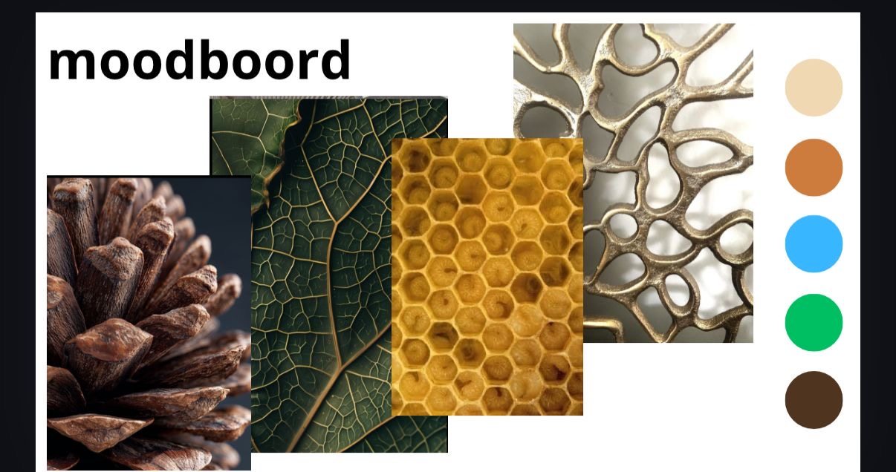
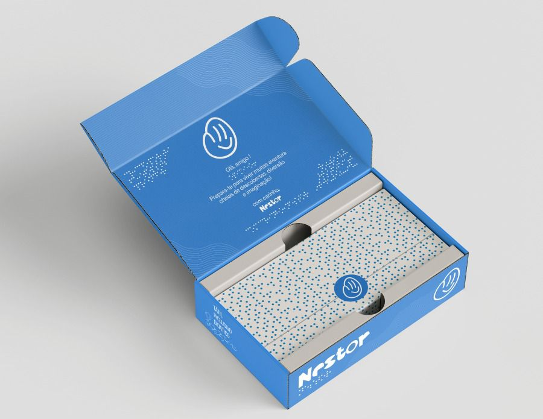

# Contexto de Design

## 1. Resumo / Abstract

### Resumo (PT)

A Nestor nasceu com o propósito de criar brinquedos educativos, inclusivos e sustentáveis em madeira, concebidos para estimular a criatividade, a aprendizagem e o desenvolvimento das crianças de forma natural, acessível e divertida. A marca procura combinar valores de responsabilidade social e ambiental, desenvolvendo produtos que incentivam a descoberta, a experimentação e a autonomia através da brincadeira.

A criação da Nestor surgiu como resposta à escassez de brinquedos adaptados às necessidades de crianças com deficiência visual. Durante a fase de pesquisa, verificou-se que grande parte dos brinquedos disponíveis no mercado é desenvolvida com forte dependência de estímulos visuais, o que dificulta a sua utilização por crianças cegas ou com baixa visão. Embora exista uma crescente preocupação com a inclusão, este público continua a enfrentar limitações no acesso a produtos lúdicos e educativos verdadeiramente adaptados às suas necessidades. A Nestor pretende contribuir para a redução desta desigualdade, oferecendo soluções que valorizam a acessibilidade sem comprometer a diversão e o potencial educativo dos brinquedos.

Os produtos desenvolvidos pela marca são pensados para proporcionar experiências de aprendizagem significativas através da exploração sensorial. Elementos táteis, formas diferenciadas, texturas, sistemas de encaixe e recursos de acessibilidade, como o Braille, são integrados de forma natural nos brinquedos, permitindo que as crianças explorem, aprendam e desenvolvam competências motoras e cognitivas através do toque. Desta forma, procura-se criar experiências inclusivas que possam ser usufruídas por todas as crianças, independentemente das suas capacidades visuais.

Cada brinquedo é cuidadosamente projetado para promover momentos de brincadeira com propósito, incentivando a curiosidade, a criatividade e a descoberta do mundo envolvente. Para além da sua função lúdica, os brinquedos procuram apoiar o desenvolvimento da coordenação motora, da perceção espacial, da capacidade de resolução de problemas e da aprendizagem sensorial, contribuindo para um crescimento mais autónomo e enriquecedor.

Mais do que criar brinquedos, a Nestor pretende promover uma infância mais inclusiva, sustentável e acessível. Através da união entre design, educação, acessibilidade e sustentabilidade, a marca procura desenvolver produtos capazes de gerar impacto positivo na vida das crianças e das suas famílias, demonstrando que é possível criar soluções inovadoras que respeitam simultaneamente as pessoas e o ambiente.

### Abstract (EN)

Nestor was created with the purpose of designing educational, inclusive, and sustainable wooden toys that stimulate children's creativity, learning, and development in a natural, accessible, and enjoyable way. The brand combines social and environmental responsibility, creating products that encourage discovery, experimentation, and independence through play.

Nestor was founded in response to the limited availability of toys adapted to the needs of children with visual impairments. During the research phase, it became evident that most toys on the market rely heavily on visual stimuli, making them difficult to use for blind or visually impaired children. Although awareness of inclusion has increased in recent years, this group still faces significant barriers when accessing truly accessible educational and recreational products. Nestor aims to help reduce this inequality by developing solutions that prioritize accessibility without compromising the educational and playful value of the toys.

The products developed by the brand are designed to provide meaningful learning experiences through sensory exploration. Tactile elements, distinctive shapes, textures, fitting systems, and accessibility features such as Braille are naturally integrated into the toys, allowing children to explore, learn, and develop motor and cognitive skills through touch. In this way, Nestor seeks to create inclusive experiences that can be enjoyed by all children, regardless of their visual abilities.

Each toy is carefully designed to promote purposeful play, encouraging curiosity, creativity, and exploration of the surrounding world. Beyond their recreational function, the toys support the development of fine motor skills, spatial awareness, problem-solving abilities, and sensory learning, contributing to a richer and more independent developmental experience.

More than simply creating toys, Nestor aims to promote a more inclusive, sustainable, and accessible childhood. By combining design, education, accessibility, and sustainability, the brand strives to develop products that generate a positive impact on the lives of children and their families, demonstrating that it is possible to create innovative solutions that respect both people and the environment.

## 2. Referências Coletivas

### 2.1. Recolha de Objetos a Redesenhar/Remisturar

Objeto 1

Objeto 2

Objeto 3

**Objeto 1 – Brinquedo de empilhamento e correspondência de formas**

Origem / Autoria:
Brinquedo educativo de madeira amplamente utilizado em contextos de aprendizagem infantil, presente em diversas marcas de brinquedos pedagógicos.

Razão da escolha:
Foi selecionado pela sua capacidade de promover o reconhecimento de formas geométricas, a coordenação motora fina e a associação entre objetos e respetivos encaixes. O sistema de correspondência de formas serviu de inspiração para a mecânica principal do projeto.

**Objeto 2 – Painéis sensoriais táteis**

Origem / Autoria:
Material educativo sensorial utilizado em contextos de educação inclusiva e estimulação precoce.

Razão da escolha:
Foi escolhido pela utilização de diferentes texturas para estimular a exploração tátil. Esta referência contribuiu para o desenvolvimento inicial do conceito de padrões sensoriais e para a reflexão sobre formas de tornar o brinquedo acessível a crianças com deficiência visual.

**Objeto 3 – Puzzle de encaixe com pegas**

Origem / Autoria:
Brinquedo pedagógico de madeira destinado ao reconhecimento de formas e cores.

Razão da escolha:
Foi selecionado devido à simplicidade da interação e ao sistema de encaixe intuitivo. A forma como as peças são manipuladas e associadas aos respetivos espaços influenciou o desenvolvimento da solução final, especialmente no que diz respeito à aprendizagem através do toque e da exploração autónoma.

### 2.2. Moodboard

As referências selecionadas para o moodboard foram maioritariamente inspiradas em elementos naturais, uma vez que estes estabelecem uma ligação direta com o conceito de sustentabilidade presente no projeto. A análise destas referências permitiu identificar formas orgânicas e texturas características da natureza, que posteriormente influenciaram o desenvolvimento visual e sensorial dos diferentes componentes dos brinquedos.

## 3. Packaging.

A embalagem foi desenvolvida com texturas táteis e informações em Braille em alto-relevo, permitindo que possa ser identificada e lida por utilizadores com deficiência visual. Foi concebida como uma solução universal para todos os brinquedos da marca, apresentando dimensões de 35 × 25 × 15 cm.

Produzida em cartão reciclável, a embalagem foi projetada para ser montada sem recurso a cola, reduzindo o desperdício de materiais e facilitando a sua reciclagem. Com o objetivo de garantir uma maior proteção durante o transporte e armazenamento dos brinquedos, foi desenvolvido o conceito de uma embalagem extensível, inspirada em estruturas expansíveis utilizadas em sistemas de acondicionamento e proteção de produtos. A principal referência para esta solução pode ser consultada em: https://pt.pinterest.com/pin/795166877992227991/.

