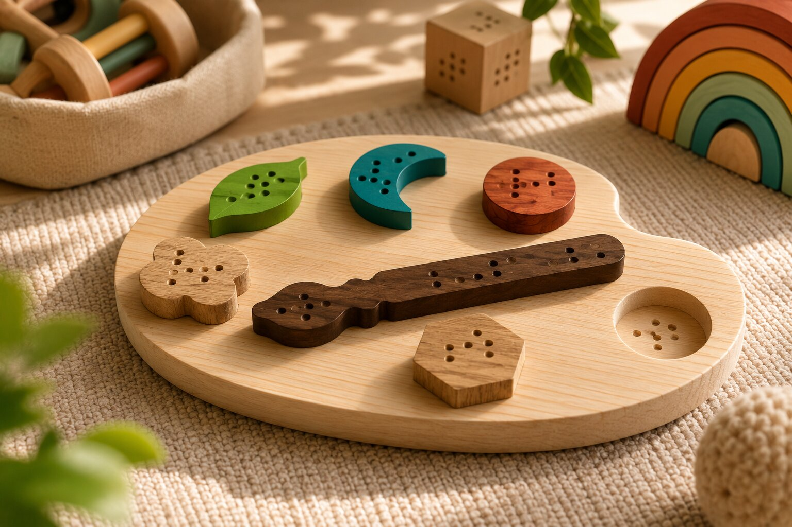

# Ver com as mãos

> Somos um grupo dedicado ao desenvolvimento de brinquedos sustentáveis e inclusivos para crianças com deficiência visual. Através da utilização de materiais sustentáveis e de experiências multissensoriais, procuramos criar produtos que promovam a aprendizagem, a autonomia e a exploração do mundo através do toque.

## Elementos do Grupo

| Número  | Nome               |
| ------- | ------------------ |
| 2024571 | Denilson Correia   |
| 2024322 | Mykyta Kiyanshecko |
| 2023221 | Laura Santos       |

---

## Contexto de Design

> Imagem criada por AI de crianças a brincar com os nossos brinquedos

A Nestor nasceu da necessidade de criar brinquedos mais inclusivos e acessíveis para crianças com deficiência visual. Durante a fase de pesquisa, verificou-se que a oferta de brinquedos adaptados a este público é reduzida, levando frequentemente à exclusão destas crianças de experiências de aprendizagem e brincadeira essenciais ao seu desenvolvimento.

Perante esta realidade, a marca propõe o desenvolvimento de brinquedos educativos em madeira que promovem a criatividade, a aprendizagem e a exploração sensorial através do toque. A sustentabilidade constitui igualmente um dos pilares do projeto, sendo privilegiada a utilização de restos de madeira provenientes da indústria do mobiliário, materiais que, de outra forma, poderiam ser descartados. Desta forma, a Nestor procura dar uma nova vida a recursos existentes enquanto cria produtos com impacto social positivo, contribuindo simultaneamente para a inclusão e para a redução do desperdício.

[Ver contexto completo →](contexto.md)

---

## Galeria de Produtos

<!-- Cada thumbnail liga à página individual de cada produto.
     Cada produto vive em produtos/<numero>-<nome>/index.md
     e tem uma sub-página produtos/<numero>-<nome>/processo.md -->

<!-- markdownlint-disable MD033 -->

  <!-- duplicar o bloco abaixo para cada produto do grupo -->

  <a class="gallery-card" href="produtos/denilson/">
    
    <h3>Nome do Produtol</h3>
    
Denilson Correia

  </a>
<a class="gallery-card" href="produtos/laura/">
    
    <h3>Palete Sensorial</h3>
    
Laura Santos

   </a>
  <a class="gallery-card" href="produtos/mykyta/">
  
  <h3>Carrinhos de Texturas</h3>
  
Mykyta Kiyashchenko

</a>
    
 
<!-- markdownlint-enable MD033 -->
[[]]

