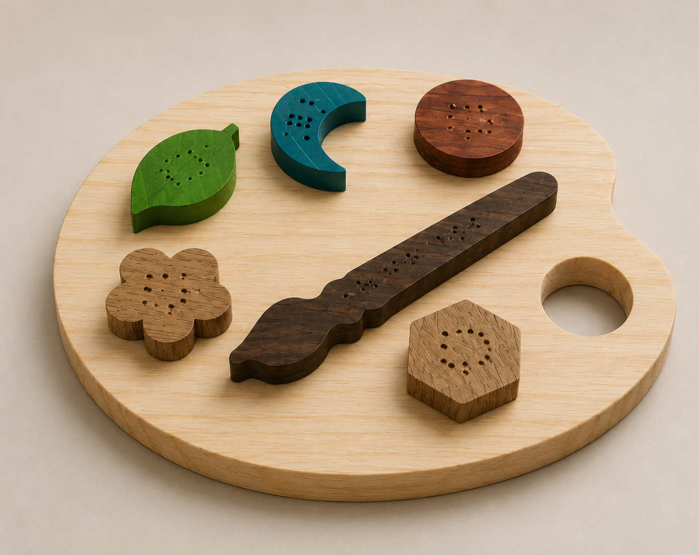

# Paleta Sensorial

<!--
  HERO: idealmente uma pseudo-sessão fotográfica do produto
  (ver tutorial Pletor.ai nos Recursos da disciplina, em
  /Recursos/AI_exps/). Usa attachments/hero.jpg para o frontmatter.
-->

> Aprende a conhecer o mundo através das mãos

A página deve tornar **visualmente percetível** a estratégia de resposta ao enunciado.
Segue a estrutura de **prancha-resumo** + **esquema-base** (C-E-T-F).

## Conceito

A Paleta Sensorial foi criada para pequenos artistas que adoram explorar o mundo através do toque, das formas e das texturas. Inspirada numa paleta de pintura, combina aprendizagem e diversão ao estimular a criatividade, a coordenação motora e a perceção tátil. Concebida para ser utilizada por todas as crianças, inclui marcações em Braille nas suas peças, tornando-a especialmente benéfica para crianças com deficiência visual ou baixa visão. Desta forma, promove uma experiência de brincadeira inclusiva, acessível e enriquecedora para todos. Recomendada para crianças a partir dos 18 meses, é perfeita para atividades educativas, sensoriais e momentos de descoberta sem fim.

> Imagem gerada por IA

## Enquadramento

A Paleta Sensorial posiciona-se no contexto do grupo através do desenvolvimento de um brinquedo inclusivo, pensado para promover a aprendizagem e a exploração tátil em crianças com deficiência visual, sem excluir as restantes crianças. O projeto segue os princípios definidos pelo grupo, recorrendo à madeira como material principal e valorizando a acessibilidade através do toque.

A recolha inicial de objetos, incluindo jogos de encaixe, paletas de cores e exemplos de Braille, permitiu identificar características que serviram de base ao desenvolvimento do produto. A partir dessas referências, foi criada uma solução que combina formas simples, encaixe e marcações em Braille, promovendo a criatividade, a coordenação motora e a inclusão de forma lúdica e educativa.

## Tecnologia

Este brinquedo foi concebido para se adaptar a diferentes tipos de madeira, oferecendo uma grande variedade de combinações e possibilidades de personalização. Graças à sua estrutura modular, é possível criar várias versões do produto, tornando cada exemplar único. Entre as combinações possíveis destacam-se:

Cada peça ser produzida num tipo de madeira diferente;
A base ser fabricada num tipo de madeira e as restantes peças em madeiras distintas;
Cada par de peças utilizar o mesmo tipo de madeira;
Todo o brinquedo ser produzido numa única madeira.

A única limitação definida no projeto é a espessura das peças, que se mantém constante nos 10 mm para garantir a compatibilidade entre todos os elementos.

O brinquedo foi desenvolvido para ser produzido principalmente através de maquinação CNC, permitindo precisão e repetibilidade no fabrico. No entanto, devido à sua flexibilidade construtiva, também pode ser produzido através de impressão 3D.

Para o desenvolvimento do projeto foram utilizados o Fusion 360 e o Adobe Illustrator. O Fusion 360 foi utilizado para a modelação paramétrica das peças, permitindo ajustes rápidos às dimensões e configurações do brinquedo. Já o Adobe Illustrator foi utilizado na criação das formas gráficas e das marcações em Braille presentes nas diferentes peças.

- Modelo 3D: <!-- https://a360.co/4vbdZWb-->
- Ficheiros: `attachments/`

## Função

A principal função deste brinquedo é estimular a perceção espacial da criança, ajudando-a a compreender conceitos de tamanho, forma e relação entre os diferentes elementos. Ao mesmo tempo, promove o desenvolvimento do raciocínio lógico, da coordenação motora fina e do reconhecimento de formas através da atividade de encaixe.

O brinquedo foi especialmente concebido a pensar em crianças com deficiência visual, integrando marcações em Braille que permitem o contacto com este sistema de leitura desde cedo. No entanto, foi desenvolvido para ser inclusivo, podendo ser utilizado por qualquer criança como ferramenta de aprendizagem e exploração sensorial.

A faixa etária recomendada situa-se entre os 18 meses e os 3 anos de idade. O brinquedo é fornecido desmontado, sendo composto por elementos que se unem através de pequenas peças de ligação encaixadas na base. Este sistema facilita tanto a montagem como a desmontagem, permitindo uma utilização simples e intuitiva.

Relativamente à segurança, o projeto foi desenvolvido de acordo com os princípios da Diretiva 2009/48/CE relativa à segurança dos brinquedos. As peças apresentam dimensões adequadas à faixa etária definida, cantos arredondados e materiais não tóxicos, minimizando riscos durante a utilização e garantindo uma experiência segura para a criança.

## Apresentação

Imagens-chave que sintetizam o produto final.

---

## Processo

O percurso completo de iterações, modelos e pesquisa está em [processo.md](processo.md), organizado do **mais recente** para o **mais antigo**.

[Ver processo completo →](processo.md)
