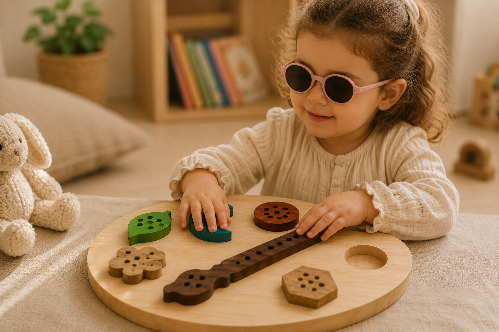

# Paleta Sensorial

<!--
  HERO: idealmente uma pseudo-sessão fotográfica do produto
  (ver tutorial Pletor.ai nos Recursos da disciplina, em
  /Recursos/AI_exps/). Usa attachments/hero.jpg para o frontmatter.
-->

> Aprende a conhecer o mundo através das mãos

A página deve tornar **visualmente percetível** a estratégia de resposta ao enunciado.
Segue a estrutura de **prancha-resumo** + **esquema-base** (C-E-T-F).

## Conceito

A Paleta Sensorial foi criada para pequenos artistas que adoram explorar o mundo através do toque, das formas e das texturas. Inspirada numa paleta de pintura, combina aprendizagem e diversão ao estimular a criatividade, a coordenação motora e a perceção tátil. Concebida para ser utilizada por todas as crianças, inclui marcações em Braille nas suas peças, tornando-a especialmente benéfica para crianças com deficiência visual ou baixa visão. Desta forma, promove uma experiência de brincadeira inclusiva, acessível e enriquecedora para todos. Recomendada para crianças a partir dos 18 meses, é perfeita para atividades educativas, sensoriais e momentos de descoberta sem fim.

> Imagem gerada por IA

## Enquadramento

Posicionamento em relação ao contexto de grupo (ver [contexto](../../contexto.md)) e à recolha de objetos a redesenhar.

## Tecnologia

Materiais (espécie de madeira), processos de fabrico (CNC, laser, impressão 3D), software paramétrico, ficheiros técnicos.

- Modelo 3D: <!-- embed Fusion ou link a360.co -->
- Ficheiros: `attachments/`

## Função

Como se brinca, idade-alvo, montagem, conformidade com a Diretiva 2009/48/CE.

## Apresentação

Imagens-chave que sintetizam o produto final.

---

## Processo

O percurso completo de iterações, modelos e pesquisa está em [processo.md](processo.md), organizado do **mais recente** para o **mais antigo**.

[Ver processo completo →](processo.md)
