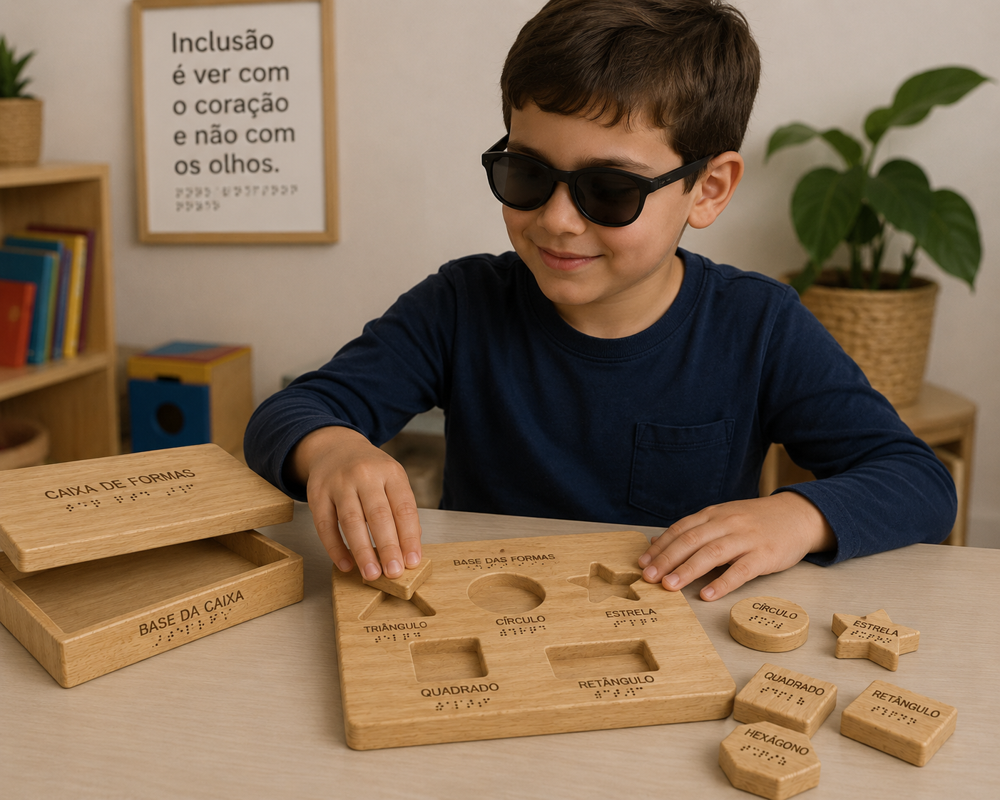
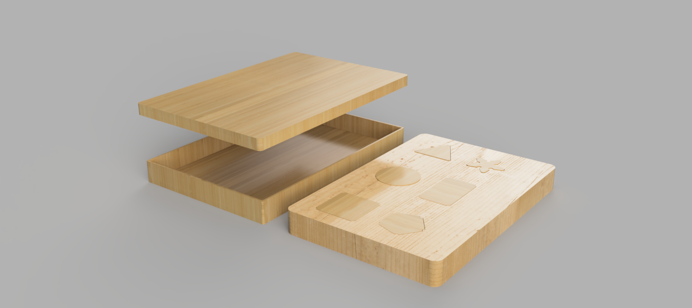

---
title:
icon: lucide/box
tags: galeria
status: not-started
hero_image: attachments/hero.jpg
hero_title: Nome do Produto
hero_subtitle: Denilson Correia · 2025-26
hero_height: 80vh
hero_overlay: 0.25
hero_align: center
published: true
student_name: ""
student_number: ""
---

# Paleta Sensorial(Tactus)

<!--
  HERO: idealmente uma pseudo-sessão fotográfica do produto
  (ver tutorial Pletor.ai nos Recursos da disciplina, em
  /Recursos/AI_exps/). Usa attachments/hero.jpg para o frontmatter.
-->

>O tapete Sensorial é um brinquedo de encaixe em MDF para crianças com deficiência visual, onde cada peça e encaixe têm o nome gravado em Braille.

## Conceito

O tapete sensorial é um brinquedo de encaixe em MDF feito para crianças com deficiência visual, dos 7 aos 11 anos. A ideia é simples: a criança encaixa peças geométricas na bandeja, usando o tato para as identificar. Para isso, cada peça e cada encaixe têm o nome gravado em Braille.
O ponto de partida foi um brinquedo de encaixe já existente, que foi redesenhado para ser mais inclusivo.

## Enquadramento

O tapete Sensorial nasceu da ideia de que um brinquedo de encaixe pode ser usado por qualquer criança, com ou sem visão. Dentro do contexto de grupo, o projeto explorou o uso de MDF e Braille para criar algo simples, tátil e inclusivo. A pesquisa inicial — jogos de encaixe e referências de Braille — definiu o caminho: uma bandeja com 6 formas geométricas que a criança identifica pelo toque.

## Tecnologia

Material
MDF — fácil de cortar e gravar, superfície lisa e segura para crianças.

Processos
Fresagem CNC — para cortar as peças e os encaixes da bandeja.

Software
Autodesk Fusion — modelação 3D de todas as peças.

- Modelo 3D: https://a360.co/4oyRqbn
- Ficheiros: `attachments/`

## Função

A criança tira as peças da bandeja e tenta colocá-las no sítio certo, guiando-se pela forma e pelo Braille. O nome da forma está gravado tanto na peça como no encaixe, o que ajuda a associar a palavra à forma.

Formas: Círculo · Quadrado · Triângulo · Retângulo · Estrela · Hexágono

Idade-alvo: 7–11 anos

Montagem: nenhuma — vem pronto a usar.

Segurança: desenvolvido de acordo com a Diretiva 2009/48/CE — cantos arredondados, materiais não tóxicos, dimensões seguras para a faixa etária.

## Apresentação

---

## Processo

O percurso completo de iterações, modelos e pesquisa está em [processo.md](processo.md), organizado do **mais recente** para o **mais antigo**.

[Ver processo completo →](processo.md)
