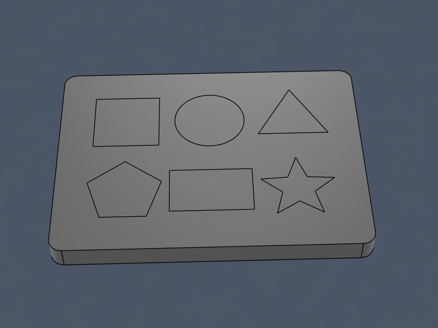
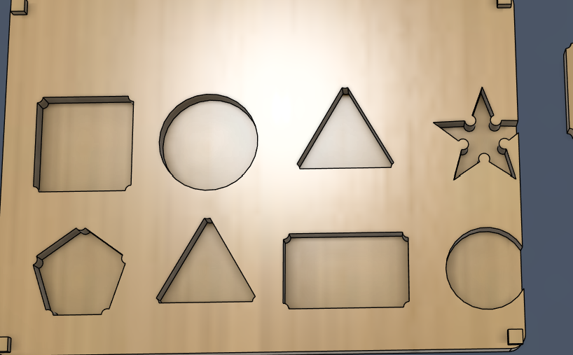
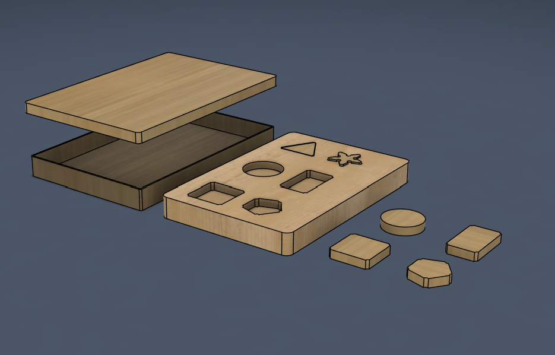
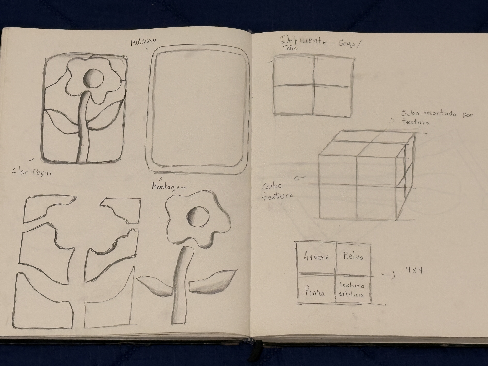
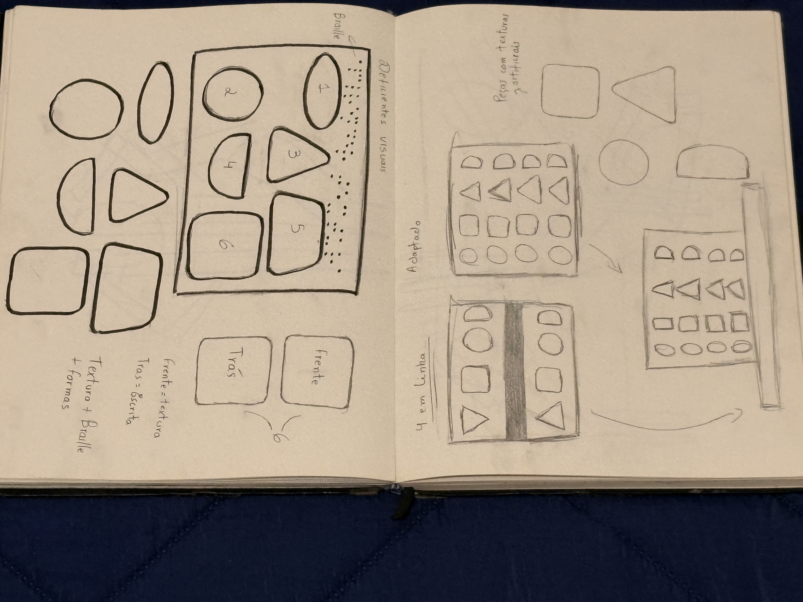
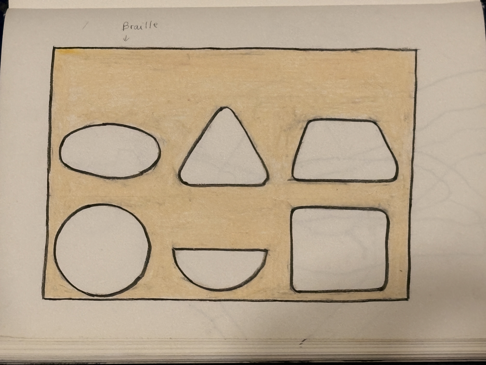
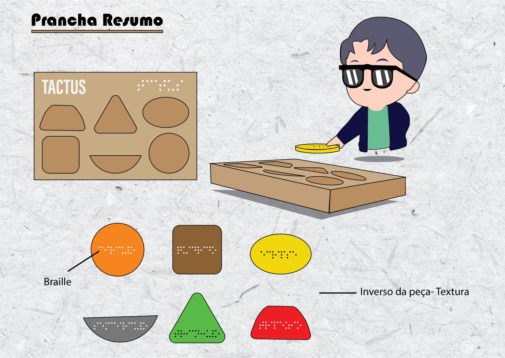
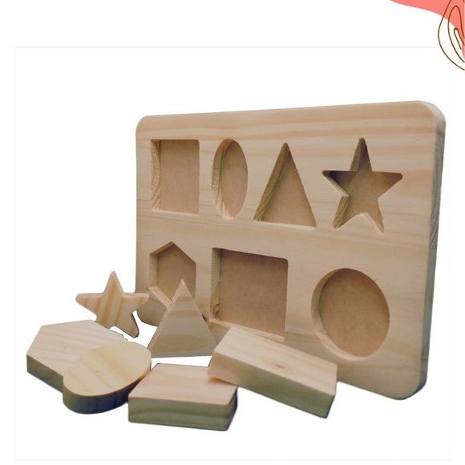

# Processo

> Organizado do **mais recente** para o **mais antigo**. Faz uma seleção que torne clara, aprazível e detalhada a evolução do produto e das ideias.

## 1. Protótipo(s)

Não foi possível realizar a impressão do protótipo em CNC.

## 2. Processo de Prototipagem

O protótipo foi desenvolvido no **Autodesk Fusion**, usando modelação paramétrica para ajustar dimensões e proporções ao longo do processo. Isso permitiu garantir coerência entre as 6 peças e afinar os encaixes da bandeja de forma rápida.

O processo começou pela bandeja principal e, depois, foram desenhadas as peças individuais e os respetivos encaixes. Durante o desenvolvimento, vários aspetos foram ajustados — proporções, espessuras, tolerâncias de encaixe — até chegar a uma versão equilibrada e funcional.

A integração do Braille foi uma das decisões centrais do processo. A proposta inicial explorava outras formas de identificação tátil, mas o Braille revelou-se a solução mais acessível e direta para o público-alvo. As inscrições em cada peça e em cada encaixe correspondem ao nome da forma em português, ligando o reconhecimento tátil à aprendizagem das figuras geométricas. 

Criação da base e formas

teste da base com 8 formas respeitando a dimensão da base e o espaço entre cada uma.

Forma final do desenvolvimento do projeto em fusion.

## 3. Protótipos Exploratórios

Testes CNC prévios, ensaios em escala, experiências de juntas/encaixes.

## 4. Modelos 3D

Embed do Fusion (visualização do modelo paramétrico).

 https://a360.co/4oyRqbn

## 5. Outros Modelos

Modelos físicos exploratórios, em cartão, espuma, madeira de teste.

## 6. Esboços e Pranchas-Resumo

Desenhos manuais, 
pranchas A3 de síntese, 
exploração de variantes.

Estudos

Estudo 2

Esboço

## 7. Pesquisa

### 7.1. Aspectos valorizados do moodboard, desconstrução da forma (o que distingue o programa formal)

### 7.2. Objetos de referencia

## 9. Outros Elementos

Outros materiais relevantes para a preparação do conceito (entrevistas, observação, testes com utilizadores, notas, leituras, inspirações).
