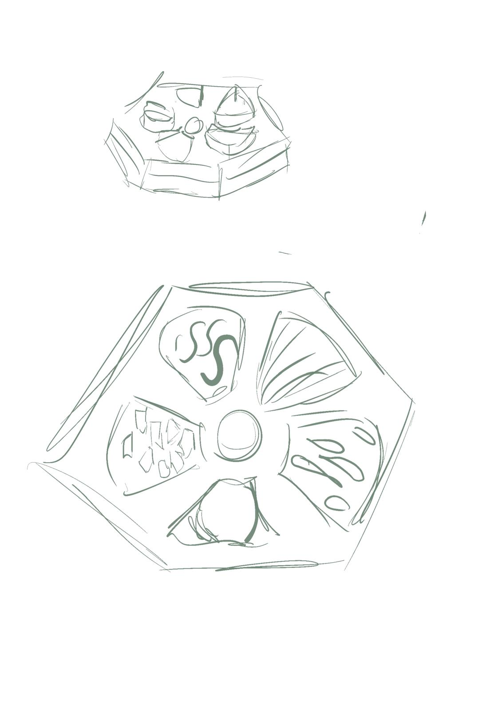
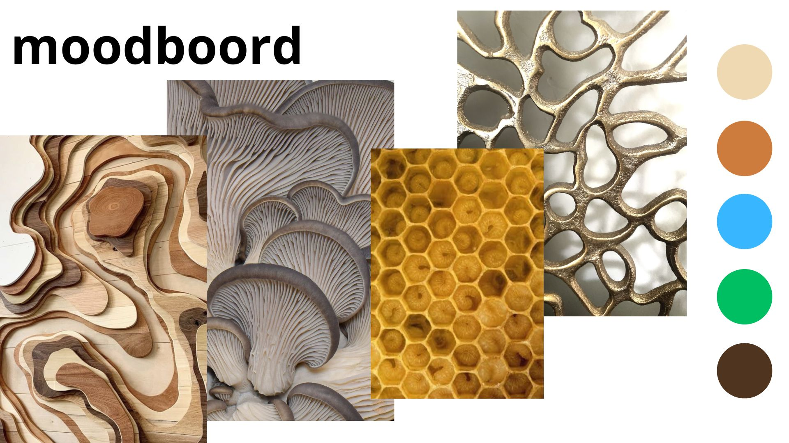

# Processo

## 1. Testes De Encaixes

Não foi possível realizar a impressão do protótipo em CNC. Por esse motivo, foram desenvolvidos protótipos dos encaixes em cartão, permitindo obter uma perceção mais próxima de como seria o resultado final do projeto.

Observações: Durante a fase de prototipagem, verificou-se a necessidade de aumentar a espessura de alguns elementos do brinquedo para melhorar a sua resistência e estabilidade. Foi também identificado que a folga definida para os encaixes era excessiva, o que resultava numa ligação pouco firme entre as peças, tornando o conjunto instável. Como tal, concluiu-se que o sistema de encaixe deveria ser revisto e ajustado para garantir uma melhor fixação e uma experiência de utilização mais

## 2. Processo de Prototipagem

O desenvolvimento do protótipo foi realizado recorrendo ao Fusion 360 e ao Adobe Illustrator. O Fusion 360 foi utilizado para a modelação paramétrica das peças, permitindo ajustar dimensões e proporções de forma rápida e consistente ao longo do projeto. Através desta abordagem, foi possível garantir que todas as formas apresentassem tamanhos semelhantes e uma linguagem visual coerente entre si. Por sua vez, o Adobe Illustrator foi utilizado para desenhar e refinar as formas gráficas da paleta e das diferentes peças que compõem o brinquedo.

O processo de prototipagem iniciou-se pela criação da base principal do brinquedo. Após a definição e validação desta estrutura, procedeu-se ao desenvolvimento das peças individuais e dos respetivos encaixes. Numa fase inicial, os encaixes foram concebidos com formato circular; contudo, durante o processo verificou-se que a máquina de corte apresentava limitações na execução deste tipo de detalhe. Como solução, os encaixes foram redesenhados com formato retangular, garantindo uma produção mais eficaz e funcional.

Relativamente aos elementos táteis, a proposta inicial previa a utilização de diferentes texturas para identificar as peças. No entanto, após reflexão e testes realizados, optou-se pela integração de marcações em Braille, tornando o brinquedo mais acessível e adequado ao público-alvo. A implementação do Braille constituiu a última etapa do processo de prototipagem. As inscrições presentes em cada peça correspondem ao nome da respetiva forma em português, permitindo uma associação entre o reconhecimento tátil e a aprendizagem da nomenclatura das figuras geométricas.

> Criação da geometria inicial da base

> Base Espelhada

> Moldagem da base

> Encaixe e DogBones

> Extrusão das peças na base espelhada

>Criação e Extrusão das peças 

>Criação dos encaixes e DogBones

>União das Peças

>Resultado Final

## 3. Modelos 3D

Embed do Fusion (visualização do modelo paramétrico).

https://a360.co/4vbdZWb

## 4. Outros Modelos

Exploração conceptual de diferentes soluções de brinquedos inclusivos desenvolvida durante a fase inicial do projeto. Estes estudos permitiram analisar diferentes formas de interação tátil, sistemas de encaixe e configurações estruturais antes da definição da proposta final.

>Estudo de um sistema de encaixe vertical inspirado em brinquedos de rosca.

>Exploração de uma solução em formato de puzzle tátil.

A última proposta desenvolvida consistiu num puzzle sensorial tátil composto por diferentes texturas. As formas e os padrões táteis utilizados foram inspirados em elementos orgânicos identificados no moodboard, procurando estabelecer uma ligação entre a exploração sensorial e as referências visuais selecionadas durante a fase conceptual do projeto.

## 5. Esboços e Pranchas-Resumo

Os esboços desenvolvidos durante a fase inicial do projeto serviram de base para a construção da solução final. A prancha resumo sintetiza as principais ideias exploradas ao longo deste processo, apresentando uma versão próxima do conceito que deu origem ao produto final.

>Exploração da forma e encaixe

>Tentativa de desenho Técnico

>Esboço de encaixe

>Prancha Resumo
## 6. Pesquisa

### 6.1. Aspectos valorizados do moodboard

Foram selecionadas referências naturais para a construção do moodboard, uma vez que estas se relacionam diretamente com o tema da sustentabilidade abordado no projeto. A partir dessas referências, foram identificadas diferentes formas e texturas presentes na natureza, que serviram de inspiração para o desenvolvimento dos elementos do brinquedo.

As texturas naturais foram utilizadas para criar padrões sensoriais que estimulam a exploração tátil por parte das crianças, permitindo-lhes reconhecer e compreender diferentes superfícies através do toque. Paralelamente, as formas inspiradas em elementos naturais contribuem para uma maior ligação com o ambiente que as rodeia, promovendo a aprendizagem e a descoberta de forma lúdica e inclusiva.

### 6.2. Objetos de referencia

Para o desenvolvimento da forma da base, foram utilizadas como referência uma paleta de pintura tradicional e uma paleta egípcia utilizada para a mistura de pigmentos. Estas referências contribuíram para a definição da forma orgânica do produto, reforçando a sua ligação ao universo artístico e inspirando a solução final adotada no projeto.

## 7. Pesquisa Bibliográfica

Durante a fase de pesquisa, foram consultados artigos relacionados com o desenvolvimento de brinquedos inclusivos para crianças com deficiência visual. Os estudos analisados destacam que a oferta de brinquedos especificamente concebidos para este público continua a ser reduzida, sendo a maioria dos brinquedos disponíveis desenvolvida para crianças sem limitações visuais. Esta constatação reforçou a relevância do projeto e a necessidade de criar uma solução que privilegiasse a exploração tátil, a acessibilidade e a aprendizagem através dos sentidos.

Os artigos Exploration of Tactile-Oriented Toy Design for Visually Impaired Children e A Novel Multi-Sensory Educational Teaching Toy for Visually Impaired Children serviram como suporte teórico para a compreensão das necessidades deste público e para a definição de estratégias de design adequadas ao desenvolvimento do brinquedo.

https://www.researchgate.net/publication/381186298_Exploration_of_Tactile-Oriented_Toy_Design_for_Visually_Impaired_Children/link/66639882b769e769191fd377/download?_tp=eyJjb250ZXh0Ijp7ImZpcnN0UGFnZSI6InB1YmxpY2F0aW9uIiwicGFnZSI6InB1YmxpY2F0aW9uIn19

https://dl.acm.org/doi/10.1145/3629296.3629365

