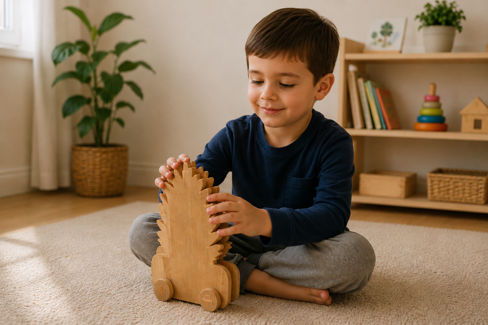

# Carinho de Textura 

<!--
  HERO: idealmente uma pseudo-sessão fotográfica do produto
  (ver tutorial Pletor.ai nos Recursos da disciplina, em
  /Recursos/AI_exps/). Usa attachments/hero.jpg para o frontmatter.
-->

> Frase-conceito (uma linha): qual é a proposta?

A página deve tornar **visualmente percetível** a estratégia de resposta ao enunciado.
Segue a estrutura de **prancha-resumo** + **esquema-base** (C-E-T-F).

## Conceito

Ideia central do produto. O que é, para quem, porquê.

Ideia central do produto:
Tentar mostrar o mundo de forma e mostrar as crianças com dificuldades visual a natureza. E também sentir as texturas dos objetos vindos da natureza e também aprender e identificar as texturas.   

O que é:
Um Carrinho de Textura para ter supostamente conjuntos da natureza como: pinha, favo de mel, textura de uma folha e textura de madeira tipo metal dourado.

Para quem:
Para as crianças com dificuldades de visuais tentar identificar as figuras presentes no carrinho. 

Porquê:
Para sentir a natureza e o mundo exterior como parque e florestas. E com o modo do brinquedo ter possiblidade de mover com ajuda de um adulto de perto.  E a forma de diversão com o modo de sentir a criança feliz.  

## Enquadramento

Posicionamento em relação ao contexto de grupo (ver [contexto](../../contexto.md)) e à recolha de objetos a redesenhar.

## Tecnologia

Materiais (espécie de madeira), processos de fabrico (CNC, laser, impressão 3D), software paramétrico, ficheiros técnicos.

- Modelo 3D: <!-- [embed Fusion ou link a360.co --](https://a360.co/4ec2YxV)>
- Ficheiros: `attachments/`

## Função

Como se brinca tentar identificar as figuras presentes no carrinho. Sentir e aprender o que estão a sentir com as formas naturais  com o as rodas tendo o equilíbrio para não cair e algumas vezes mover para dar para outras crianças e passarem para adultos(Pais).

Idade-alvo Crianças e Crianças com dificuldades visuais 

 Montagem com conjuntos  de retirar o o que tinha formato para outro com  super visão de um adulto 

conformidade com a Diretiva 2009/48/CE.

## Apresentação

Imagens-chave que sintetizam o produto final.

---

## Processo

O percurso completo de iterações, modelos e pesquisa está em [processo.md](processo.md), organizado do **mais recente** para o **mais antigo**.

[Ver processo completo →](processo.md)
